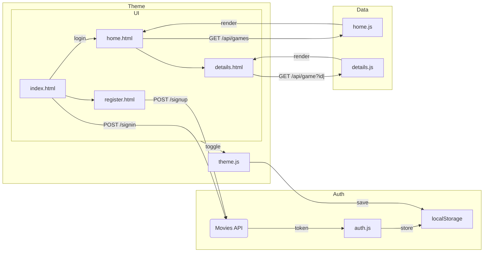

## Game Over

A client-side web application that lets users browse and explore free-to-play games across various categories. Features include user authentication, game browsing by category, detailed game information views, and theme customization.

[](https://sh-ashraf.github.io/Game-Over/)

---

### 🎯 Purpose & Scope

**Game Over** is designed as an interactive catalog of free-to-play games. Users can:

* Create an account and securely log in
* Browse games by category (e.g., Shooter, RPG, Strategy)
* View detailed information and screenshots for each game
* Toggle between light and dark themes, with preferences saved across sessions

This purely client-side app uses HTML, CSS, and JavaScript, leveraging external APIs for authentication and game data.

---

### 🏗 System Architecture

Client-side MVC pattern with four main components:

1. **User Interface**

   * `index.html` (Login)
   * `register.html` (Sign-up)
   * `home.html` (Browse & filter)
   * `details.html` (Game details)

2. **Authentication System**

   * `auth.js` handles registration, login, and token storage (in `localStorage`)
   * Uses the Movies API for sign-in/sign-up endpoints

3. **Game Data System**

   * `home.js`: Fetches and renders game lists by category (`/api/games?category=`)
   * `details.js`: Fetches and renders game details by ID (`/api/game?id=`)

4. **Theme System**

   * Toggles `data-theme` attribute on `<html>`
   * Stores preference under `localStorage['mode']`



---

### 🔑 Key Features

* **User Authentication**: Secure sign-up and sign-in flows with session persistence
* **Category Filter**: Quickly find games by selecting categories or using the search bar
* **Game Details**: View screenshots, descriptions, system requirements, and external links
* **Responsive Design**: Mobile-first layout built with Bootstrap
* **Dark/Light Mode**: Instant theme toggle stored in `localStorage`
* **Notifications**: Client-side alerts using Toastr

---

### ⚙️ Installation & Setup

1. **Clone the repository**

   ```bash
   git clone https://github.com/your-repo/GameOver.git
   cd GameOver
   ```
2. **Install dependencies** (if any build tools are used)

   ```bash
   npm install
   ```
3. **Serve the files**
   Open `index.html` in your browser, or use a simple HTTP server:

   ```bash
   npx http-server . -p 8080
   ```
4. **Browse**
   Navigate to `http://localhost:8080` and start exploring!

---

### 🛠 Technology Stack

* **Frontend**: HTML5, CSS3 (Bootstrap), JavaScript (ES6+)
* **APIs**: Movies API (auth), Free-to-Play Games API (data)
* **Storage**: `localStorage` for tokens and theme
* **Libraries**: jQuery, Toastr, Font Awesome

---

### 🤝 Contributing

Contributions are welcome! To get started:

1. Fork the repo
2. Create a feature branch: `git checkout -b feature/YourFeature`
3. Commit your changes: `git commit -m "Add YourFeature"`
4. Push to your branch: `git push origin feature/YourFeature`
5. Open a Pull Request

---

### 📄 License

This project is licensed under the MIT License. See [LICENSE](LICENSE) for details.

---

*Happy gaming!*
